# Troubleshooting Connection Issues

This guide is here in case you are having trouble getting (or keeping) your trackers connected to the SlimeVR Server app. This guide **does not** cover causes and solutions for high ping, choppy tracking or any other tracking issues that come up after you've already successfully connected your trackers.

Before you can try any given solution, it's important that you first determine what the actual symptoms are. This document will guide you through a couple common situations and their possible fixes.

This guide will assume that you are on the "Connect trackers" screen inside the SlimeVR app.

# Before you do anything

It's worth trying some dumb solutions to see if those fix your issues. Restart your PC and your router. You'd be surprised how many issues this solves.

**If you have a router from Spectrum, Netgear or Eero**, you might want to just skip this entire document and go straight to [alternative Wi-Fi options](https://docs.slimevr.dev/server/alternate-wifi.html). These routers are known to commonly have issues with slimes, without a whole lot of options to fix it.

# Checking the serial console for logs

Many of these issues need you to check the serial console for diagnosing the cause. For that, click the "I'm having trouble connecting!" button at the top.

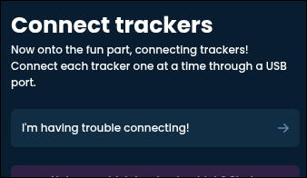

This should bring you to the serial console screen.

|PC view|Mobile view|
|:-:|:-:|
|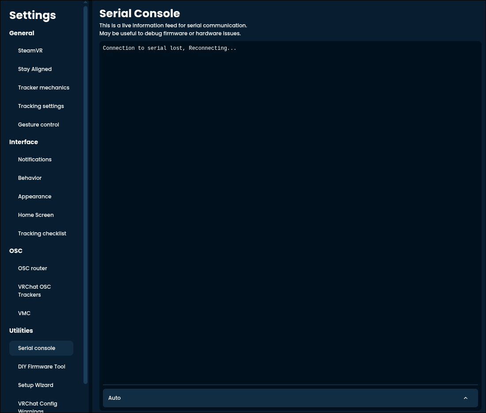|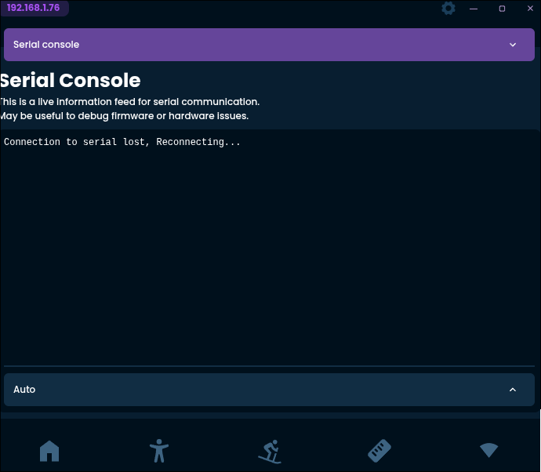|

If you connect a tracker to your device, several controls should appear at the bottom and some text should appear in the above box.

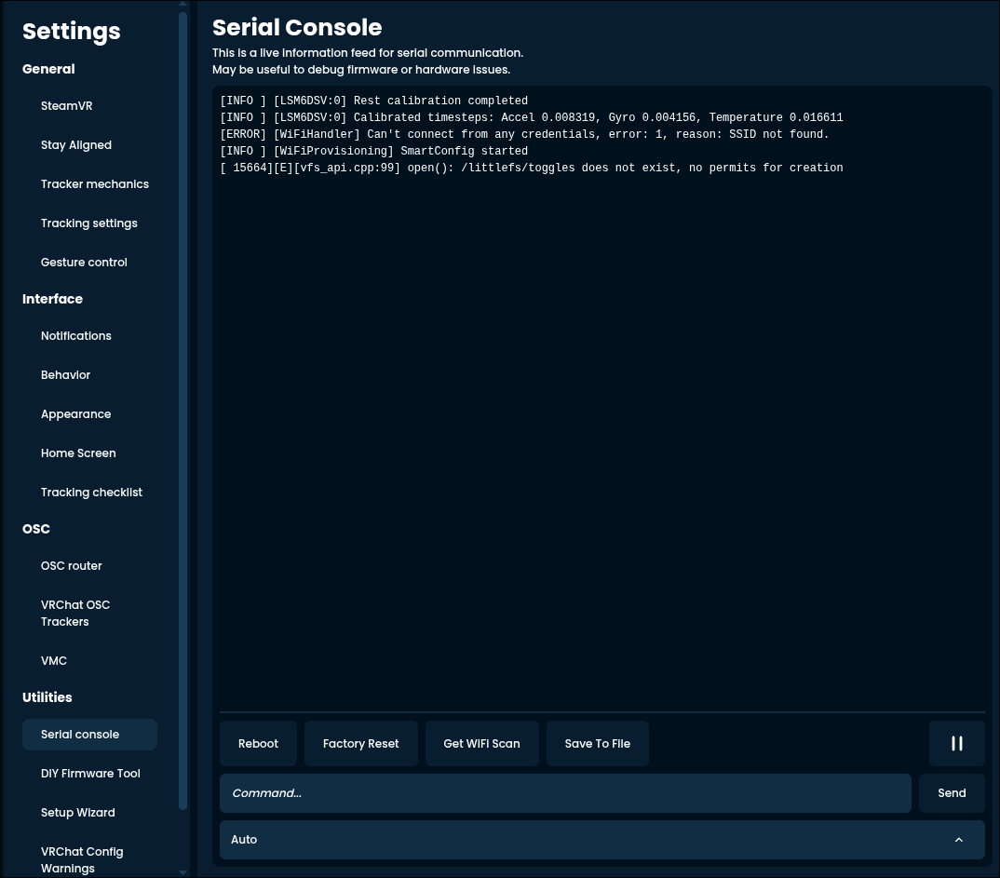

These are what each of them do:
- Reboot: restarts the tracker without you having to touch it.
- Factory Reset: wipes all calibration and configuration data from the tracker, including Wi-Fi details. **Does not reset the firmware of the tracker**.
- Get WIFI Scan: shows you the available Wi-Fi networks around the tracker.
- Save To File: saves the text into a handy log file, useful for asking others for help (though a screenshot is usually simpler to view for most).
- Pause button to the right: pauses the scrolling of the console window for easier reading.
- "Command..." input and "Send" button: allows you to send custom commands.
- Dropdown (or dropup?) at the bottom: if you have multiple trackers connected, let's you pick which one you want to mess with.

Most of the diagnosing happens by just reading the text dump that the tracker gives you. **Before anything, click "Reboot"**. This shows the information from the very beginning, which is necessary.

## "No trackers detected"

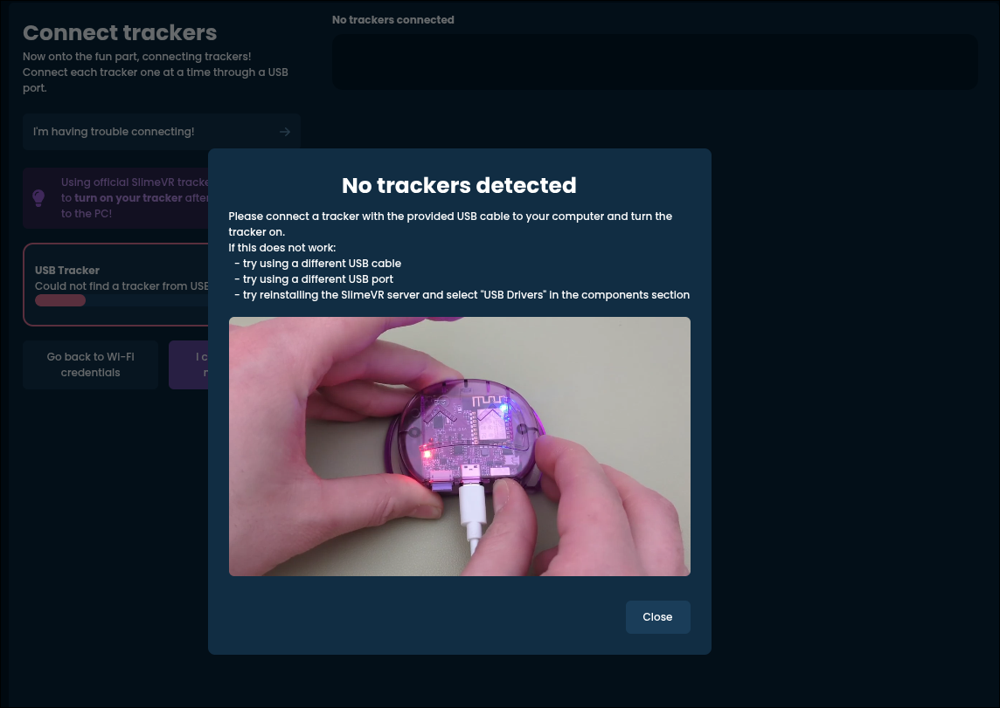

Symptoms:
- The app doesn't seem to pick up the tracker you plugged in.
- The bar below "Looking for trackers" never moves.
- A pop-up saying "No trackers detected" appears.

This means that your PC is not seeing the tracker you've plugged in for whatever reason.

Things to try:
- Make sure you **plug the tracker into your PC**.
    - It's not enough to plug the tracker into a charger.
    - The USB cable on both ends should be fully in place, this might require a bit of force. If you do it correctly, you should hear a faint click.
- Make sure your tracker is **turned on**.
    - Usually when the tracker is on, the light on it will blink from time to time.
- Make sure you are **using a proper, data capable USB cable**.
    - If you are on Windows, you should hear the classic USB notification sound when you plug the tracker in.
    - If the cable splits into multiple ends, don't use it, get a different one.
- Try different cables, different USB ports on your computer.
    - Some cables might just be faulty, or the port might have some odd behaviour.

Some more esoteric possibilities:
- Have you messed with the firmware on the tracker? You might have made an error there.
- Does the tracker not turn on even when it's powered on? It might be faulty.

## "Obtaining the tracker mac address" stuck in a loop

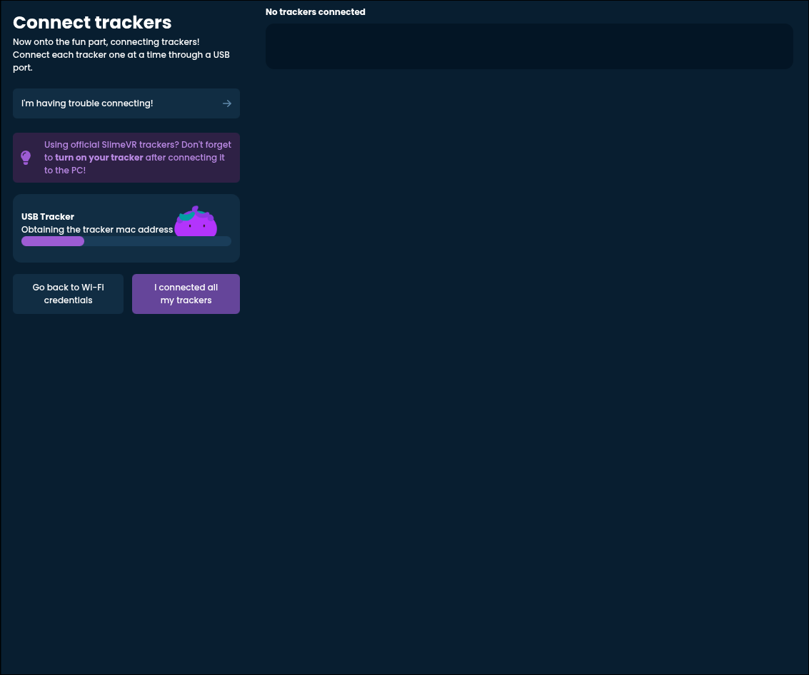

This is a very rare issue.

Symptoms:
- "Obtaining the tracker mac address" status appears, then immediately disappears, potentially in a loop.
- Serial console shows no response to "REBOOT" or spams garbled or repeating messages.

Things to try:
- Usually this means that there is no firmware on the tracker, or that it's broken. If you tried updating the tracker, you might have made a mistake somewhere. Try again to recover it.

## "Could not get logs from the tracker"

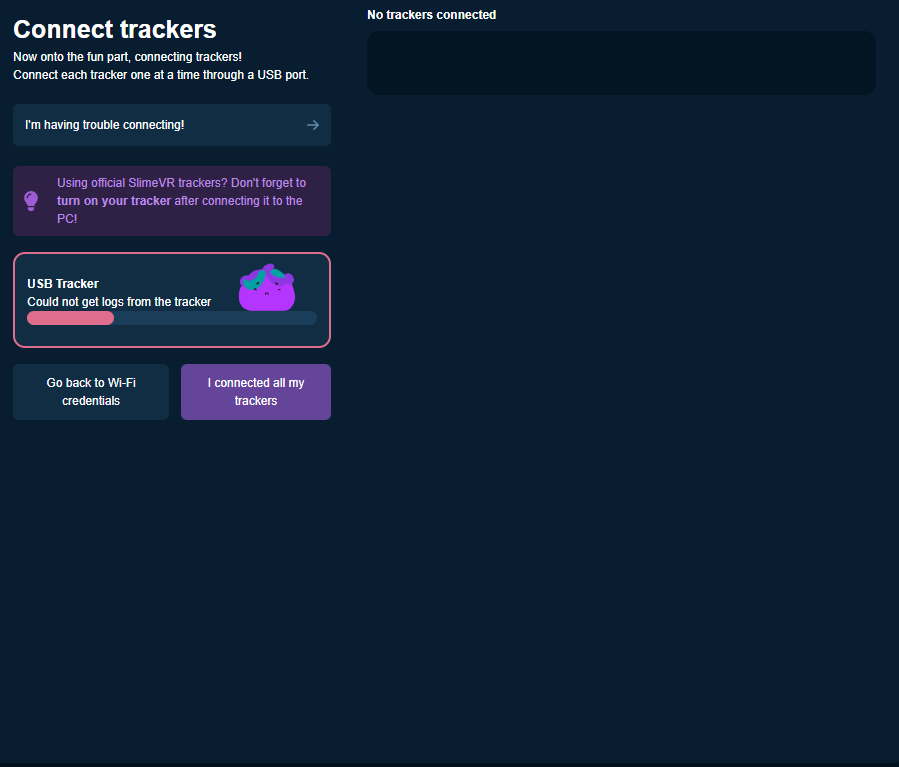

This is a very rare issue.

Symptoms:
- "Could not get logs from the tracker" error appears.

When the server tries to communicate with the tracker, it does that by sending text to the tracker, and receiving replies. This error usually means that while the tracker was seemingly recognized, the communication is not possible for whatever reason.

Things to try:
- Check if you have any other device plugged into your PC that SlimeVR might be confused by. Common culprits are custom keyboards or PiShock devices.
- Try restarting your computer. Something might be running that is forcefully taking over the USB ports.
- Sometimes it might help to manually enter Wi-Fi details through the serial console. See the details in the [relevant section](#manually-entering-wi-fi-details).

## "Unable to connect to Wi-Fi"

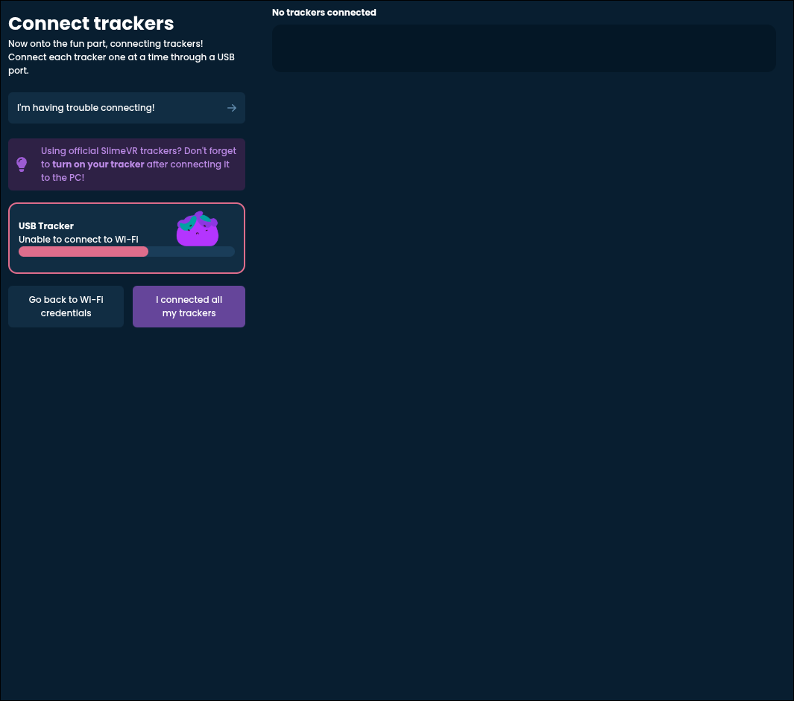

This is probably the most common issue on this list.

Symptoms:
- The tracker is detected properly
- After showing "Trying to connect to connect to Wi-Fi" for a while, it errors and says "Unable to connect to Wi-Fi"
- The issue happens on every tracker

It's best to check the serial console to further find out the cause of this issue. Look for a pair of lines that say
```
Loaded credentials for SSID '...' and pass length ...
```
and
```
Can't connect from saved credentials, error: ..., reason: ...
```

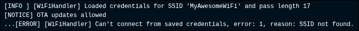

Check what the given reason is. The options are:

### Wrong password

Check that you entered your password correctly (you probably didn't). Did you accidentally include a space or any other character? Did you mix up some characters by accident? If you try to connect from your phone with that password, does it work?

### SSID not found

Your tracker cannot see the Wi-Fi network you are trying to connect it to. This usually means that you are trying to connect to a Wi-Fi that isn't supported by slimes, or that you typo'd the name.

Head on over to the [section about checking your available Wi-Fi networks](#checking-what-wi-fi-networks-your-slime-sees).

### Timeout

Sadly this error isn't particularly helpful, and usually it boils down to your router not liking you very much. Try an [alternative Wi-Fi option](https://docs.slimevr.dev/server/alternate-wifi.html) or purchase one of the many recommended (and fairly priced) routers from that same page.

## One or multiple trackers don't connect, others do

Symptoms:
- Most of your trackers, or at least some connected just fine.
- One or multiple trackers refuse to connect.

Some routers have inherent limitations on how many devices they can handle. Infamously the Puppis S1 "dedicated VR router" can only handle up to 8 by default. This is also the case for the Windows Mobile Hotspot solution detailed in the [alternative Wi-Fi options guide](https://docs.slimevr.dev/server/alternate-wifi.html). If you have more than 8 trackers, you will need to find a different option or get a different router (possibly even just for the trackers).

## Could not find the server

Symptoms:
- The trackers connect to Wi-Fi just fine.
- They fail with an error saying "Could not find the server".

This usually means that, while the tracker can connect to Wi-Fi, it cannot locate the SlimeVR Server app (the one right in front of you) on that network. This can also boil down to several possibilities.

### You are connected to some kind of shared or public Wi-Fi

Commonly public Wi-Fi (like in hotels), dorm Wi-Fi, Wi-Fi shared with others, or any other similar network will be closed off so that you don't see the other people on it for security reasons. This is of course not great when that's required for SlimeVR, you need to look into [alternative Wi-Fi options](https://docs.slimevr.dev/server/alternate-wifi.html).

### You are using a mesh network or access points

The section on [checking available Wi-Fi networks](#checking-what-wi-fi-networks-your-slime-sees) goes into this in detail and how you can determine if this is the case.

### Your network is set as "public" within Windows

This instructs Windows to hide your PC on the network as much as possible. This shouldn't be the case if it's your own private Wi-Fi network.

To fix this:
1. Open the Windows Start Menu.
2. Search for "Settings" and open it.
3. Look for "Network & internet", click it.
4. If you are using an Ethernet (wired) connection, pick that, if you are on Wi-Fi, pick that on the right side.
5. Make sure out of the two options (public and private), **private** is selected.
6. If it wasn't, restart SlimeVR.

If it was set to private, this isn't the droid you are looking for.

### Your firewall is too aggressive

If you are on Windows, try the following:
1. Press the Windows key + R (at the same time), a small dialogue box should appear.
2. Type or paste in `C:/Program Files (x86)/SlimeVR Server`, and hit "Ok" or press "Enter". A file explorer should now open with the SlimeVR folder in it.
3. Find the file called "firewall.bat". Right click and pick "Run as administrator".
4. If a prompt shows up asking you to confirm, do that.
5. A black window should appear and promptly disappear, this should have fixed the issue.
6. Restart SlimeVR.

If you are on Mac, see if you are running something like PortMaster or similar. Try turning them off.

If you are on Linux, Google is your friend here. Also check the [relevant documentation](https://docs.slimevr.dev/tools/linux-installation.html#firewall-rules).

# Checking what Wi-Fi networks your slime sees

To see a list of Wi-Fi networks your slime sees, go back to the serial console and hit "Get WIFI Scan". (If it happens to fail, just try again until you see something resembling the image below).

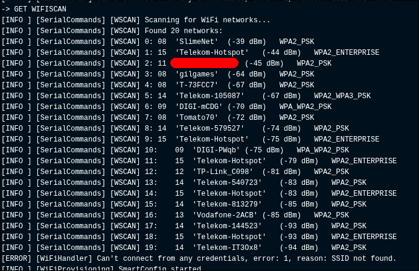

This might seem overwhelming at first, but it's actually very simple. Each line is a separate Wi-Fi network that your slime can see. Check if what you've tried to enter is in there. If not, see if you recognize a similar one. For example, if you entered "MyAwesomeWiFi" and that didn't work, but you see that there is one named "MyAwesomeWiFi 2.4", that might be the one you want!

Another thing to pay attention to is the exact name of the Wi-Fi. Check if there are any rogue spaces in there (everything between the '' marks is part of the name). Make sure you include that too if there is.

> [!WARNING]
> Wi-Fi names are **case sensitive**. This means that typing "myawesomewifi" instead of "MyAwesomeWiFi" will not work. Make sure you typed every single uppercase letter as uppercase and vica versa.

If your Wi-Fi name appears multiple times on the list, you likely have access points set up or a mesh network. It's technically possible to get those working, but nothing is guaranteed, you might be better off trying an [alternative Wi-Fi option](https://docs.slimevr.dev/server/alternate-wifi.html).

# Manually entering Wi-Fi details

If all else fails, you can circumvent the "Connect trackers" screen and do the dirty work yourself. First, head over to the serial console, and make sure your tracker communicates just fine with the server (by clicking "Reboot").

At the bottom you should see an input field with "*Command...*" inside it.


Enter the following:

```
SET WIFI "MyWiFiName" "MyWiFiPassword"
```

Change `MyWiFiName` and `MyWiFiPassword` to your Wi-Fi credentials. **Keep the quotation marks (these: ")**.

Click "Send". A warning box should appear.

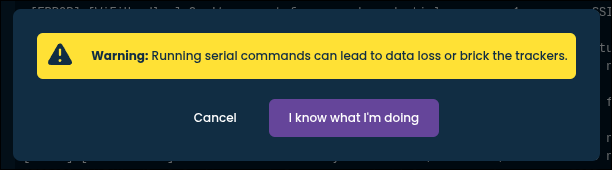

Click "I know what I'm doing". Everything here is safe and won't affect your trackers negatively.

A line saying "New wifi credentials set, reconnecting" should now appear. If you've done everything correctly, the tracker should now connect to the Wi-Fi, which will be indicated with a line "Connected successfully to SSID '...', IP address ...".
